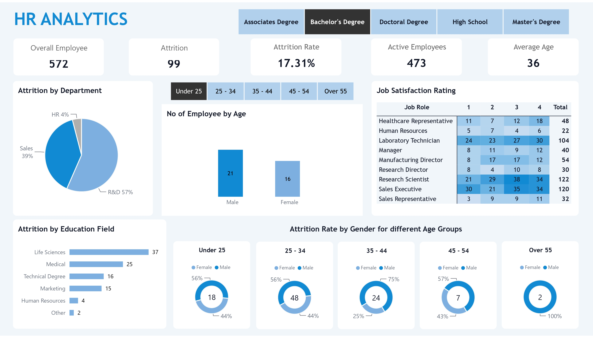

# 👥 HR Analytics Dashboard

An interactive **HR Analytics Dashboard built with Microsoft Power BI** to transform workforce data into clear insights around employee attrition, demographics, job satisfaction, education, age, and gender.

The dashboard provides HR teams and decision-makers with a centralized view of workforce patterns that can support **retention analysis, workforce planning, and employee management**.

---

## 📊 Dashboard Preview



---

## 🔗 Live Dashboard

👉 **[View the Interactive Power BI Dashboard](https://app.powerbi.com/view?r=eyJrIjoiNGI1ODYzMWMtNmI5Yy00MzU0LWFlZDMtNjJlNTgwNmU1MzUyIiwidCI6IjA3M2U1ODhkLTI4NmMtNDAwNS04ZmYwLWYyYWMzYzhlYTRkMyJ9)**

---

## 🎯 Project Overview

Employee turnover is an important workforce challenge for organizations. This project uses Power BI to analyze employee data and provide a clearer understanding of **attrition patterns, workforce demographics, education backgrounds, and job satisfaction**.

The dashboard allows users to interact with the data using filters for **education level and age group**, helping explore different employee segments.

---

## 📌 Key Performance Indicators

| Metric | Value |
|---|---:|
| 👥 Overall Employees | 572 |
| 📉 Employees with Attrition | 99 |
| 📊 Attrition Rate | 17.31% |
| 🟢 Active Employees | 473 |
| 🎂 Average Age | 36 |

---

## 🔎 Key Analysis Areas

### Attrition by Department

Analyzes employee attrition across departments to identify where workforce turnover is concentrated.

### Employee Distribution by Age & Gender

Provides a view of employee distribution across different gender and age segments.

### Job Satisfaction

Examines job satisfaction ratings across different roles, including:

- Healthcare Representative
- Human Resources
- Laboratory Technician
- Manager
- Manufacturing Director
- Research Director
- Research Scientist
- Sales Executive
- Sales Representative

### Attrition by Education Field

Analyzes attrition across different educational backgrounds, including:

- Life Sciences
- Medical
- Technical Degree
- Marketing
- Human Resources
- Other

### Attrition Rate by Gender & Age Group

Compares attrition patterns between male and female employees across different age groups:

- Under 25
- 25–34
- 35–44
- 45–54
- Over 55

---

## 🛠️ Tools & Technologies

- **Microsoft Power BI**
- **Power Query**
- **DAX**
- **Data Cleaning**
- **Data Modeling**
- **Data Visualization**
- **HR Analytics**

---

## 📈 Business Questions

This dashboard helps answer questions such as:

- Where is employee attrition concentrated?
- How does attrition vary across age groups?
- How does attrition differ by gender?
- Which education fields have higher employee attrition?
- How does job satisfaction vary across job roles?
- What does the current active workforce look like?
- How can HR teams better understand workforce retention patterns?

---

## 💡 Business Value

The dashboard demonstrates how HR data can be transformed into an **interactive decision-support tool** rather than simply presenting raw employee records.

By bringing key workforce metrics into one view, HR teams can more easily identify patterns that may require further investigation and support data-driven workforce planning.

---

## 📁 Repository Structure

```text
HR-Analytics/
│
├── HR analytics group.pbix
├── HR ANALYTICS.xlsx
├── HR analytics group.jpg
└── README.md
